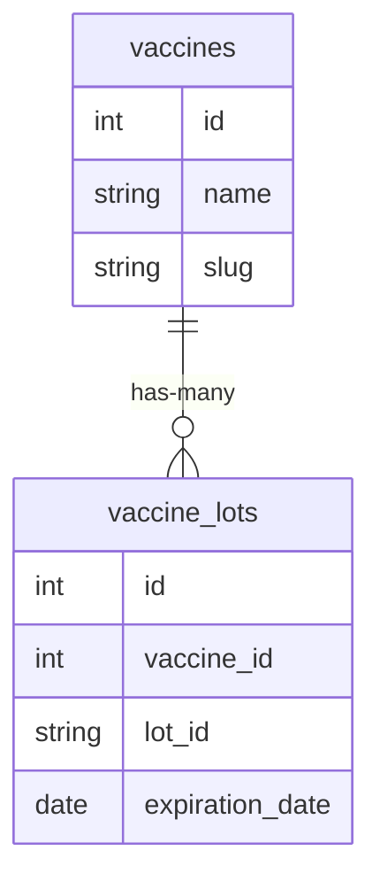

# Challenge Controle de Vacinação

## Database

```mermaid
erDiagram
    vaccines {
        int id
        string name
        string slug
    }
    
    vaccine_lots {
        int id
        int vaccine_id
        string lot_id
        date expiration_date
    }

    vaccines || -- o{ vaccine_lots : has-many
```

### Vacinas
Cada vacina pode ter vários lotes.
Cada lote de vacina possui apenas uma data de validate.
