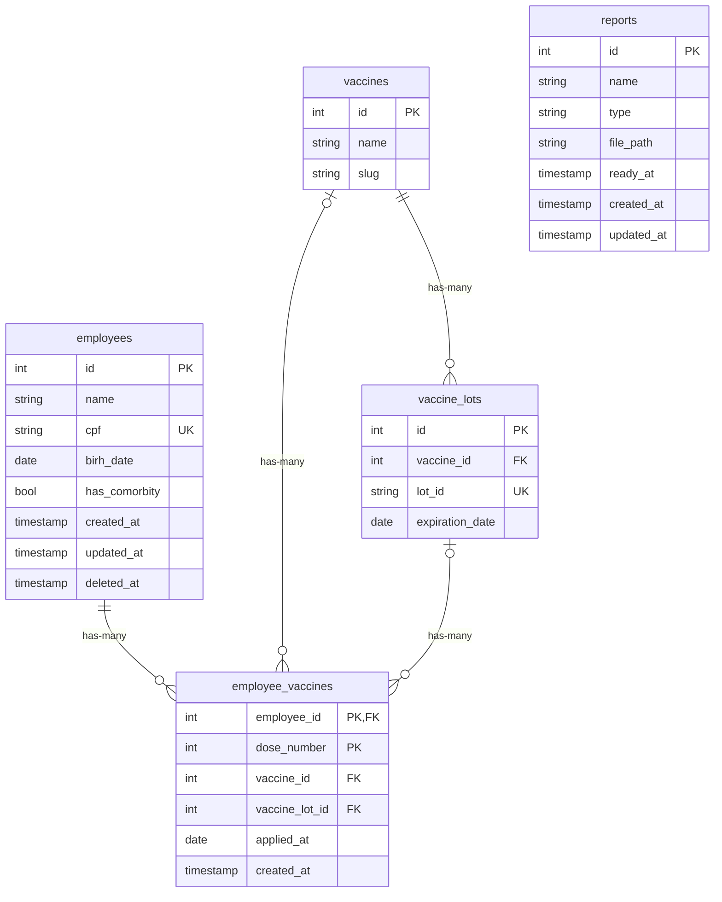

# Challenge Controle de Vacinação

## Database ER

### Vacinas
- Cada vacina pode ter vários lotes.
- Cada lote de vacina possui apenas uma data de validate.

## Funcionários
- Cada CPF de funcionário é único.
- Um funcionário pode receber até 3 doses de vacina.
- Cada vacina aplicada no funcionário pode ser de marca diferente
e possuir lotes e datas de validades diferentes entre elas.

## Relatórios
Ao criar um relatório, primeiro é salvo um registro apenas com seu id e timestamps
enquanto um job para processamento assíncrono é processado por workers.
Após a finalização do processamento do relatório, suas informações são salvas e é emitido
um evento para atualizar a página de relatórios em tempo real.
