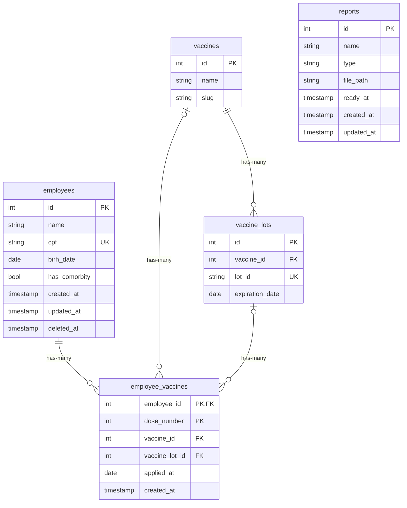

# Challenge Controle de Vacinação

## 1. Pré-Requisitos
- PHP >= 8.2
- Composer >= 2.0
- Mysql >= 8.0
- NodeJS >= 22.13
- NPM >= 10.9.2
- Redis >= 5

## 2. Iniciar Projeto com Docker
```shell
# Baixar e instalar dependências do projeto relacionadas com PHP utilizando uma imagem com composer
docker run --rm -u "$(id -u):$(id -g)" -v $(pwd):/opt -w /opt laravelsail/php82-composer:latest \
  composer install --ignore-platform-reqs

# Criar arquivo .env com base no .env.example
cp .env.example .env

# Não esquecer de validar variáveis de ambiente antes de realizar a build com docker compose

# Criar a build do docker compose
./vendor/bin/sail build --no-cache

# Iniciar projeto com docker
./vendor/bin/sail up -d

# Gerar chave do projeto
./vendor/bin/sail artisan key:generate

# Baixar e instalar dependências do projeto relacionadas com NodeJS
./vendor/bin/sail npm install --no-save

# Realizar build de telas do sistema
./vendor/bin/sail npm run build

# Criar tabelas e popular banco de dados
./vendor/bin/sail artisan migrate --seed

# Para executar popular o banco de dados com funcionários e lotes de vacina (Pode levar alguns minutos)
./vendor/bin/sail artisan migrate:fresh --seeder=HeavyDatabaseSeeder

# Acessar sistema em http://127.0.0.1
```
### 2.1 Credenciais
Assim que o sistema tiver sido configurado, o mesmo poderá ser acessado na url [127.0.0.1:80](http://127.0.0.1:80)
com as credenciais:
- login: test@example.com
- senha: password

## 3. Tecnologias Utilizadas
### 3.1 Laravel
Laravel foi escolhido como framework principal devido à sua robustez, flexibilidade e adesão aos princípios do SOLID
e MVC (Model-View-Controller). Isso facilita a implementação de boas práticas de desenvolvimento, como separação de
responsabilidades e reutilização de código. Além disso, o framework oferece uma grande variedade de funcionalidades
nativas, como autenticação, validação, middleware e sistema de filas, que são ideais para atender aos requisitos do
case técnico, como a geração de relatórios de não vacinados.

Outro ponto que reforça a escolha do Laravel é sua capacidade de integração com migrations, permitindo criar, alterar
e versionar a estrutura do banco de dados diretamente no código, o que facilita o uso de boas práticas na modelagem
relacional. A comunidade ativa e uma rica documentação tornam o Laravel uma escolha segura e eficiente para projetos
de médio a grande porte, garantindo escalabilidade e manutenibilidade do sistema.

### 3.2 Inertia.js + Vue.js
O uso do Inertia.js combinado com Vue.js foi selecionado para criar uma interface de usuário moderna e responsiva,
sem comprometer a simplicidade do desenvolvimento. O Inertia.js funciona como uma ponte entre o Laravel (backend) e
o Vue.js (frontend), permitindo construir Single Page Applications (SPAs) sem a necessidade de uma API REST separada,
simplificando o fluxo de dados entre o cliente e o servidor.

Por outro lado, o Vue.js é uma escolha estratégica devido à sua curva de aprendizado suave, extensibilidade e poder
para construir interfaces reativas e intuitivas. Ele facilita a validação lógica dos campos no lado do cliente, como
solicitado no case técnico, além de oferecer um ecossistema maduro para melhorar a usabilidade, como o uso de
bibliotecas de componentes visuais (ex.: Vuetify ou Element Plus).

### 3.3 Laravel Reverb
O Laravel Reverb foi escolhido para gerenciar notificações em tempo real e eventos assíncronos, garantindo uma
experiência mais dinâmica para os usuários do sistema. Ele oferece uma maneira fácil de implementar filas e websockets,
essenciais para funcionalidades como geração de relatórios e envio de notificações ao sistema de fila solicitado.

Outro motivo é a sua compatibilidade com Redis, que será usado como driver para cache e filas, promovendo alta
performance e reduzindo a carga no banco de dados relacional. A integração nativa com o Laravel facilita a
implementação de eventos e listeners para automação de processos complexos, como a extração de relatórios detalhados
sobre os funcionários não vacinados.

### 3.4 Redis
Redis foi escolhido como solução de cache por sua velocidade e eficiência em armazenar dados na memória. Isso é
essencial para o caching dos dados das vacinas, permitindo consultas rápidas e melhorando significativamente o
desempenho do sistema, mesmo em cenários de alto volume de dados (como centenas de milhares de registros).

Além disso, o Redis também será usado como driver para filas no Laravel. Sua natureza baseada em memória possibilita
o processamento de tarefas assíncronas, como a geração de relatórios e envio de notificações, de forma rápida e
escalável. A combinação de cache e filas com Redis é uma solução confiável e amplamente adotada em sistemas de
alto desempenho.

## 4. Database ER


### 4.1 Vacinas
- Cada vacina pode ter vários lotes.
- Cada lote de vacina possui apenas uma data de validate.

### 4.2 Funcionários
- Cada CPF de funcionário é único.
- Um funcionário pode receber até 3 doses de vacina.
- Cada vacina aplicada no funcionário pode ser de marca diferente
e possuir lotes e datas de validades diferentes entre elas.

### 4.3 Relatórios
Ao criar um relatório, primeiro é salvo um registro apenas com seu id e timestamps
enquanto um job para processamento assíncrono é processado por workers.
Após a finalização do processamento do relatório, suas informações são salvas e é emitido
um evento para atualizar a página de relatórios em tempo real.
