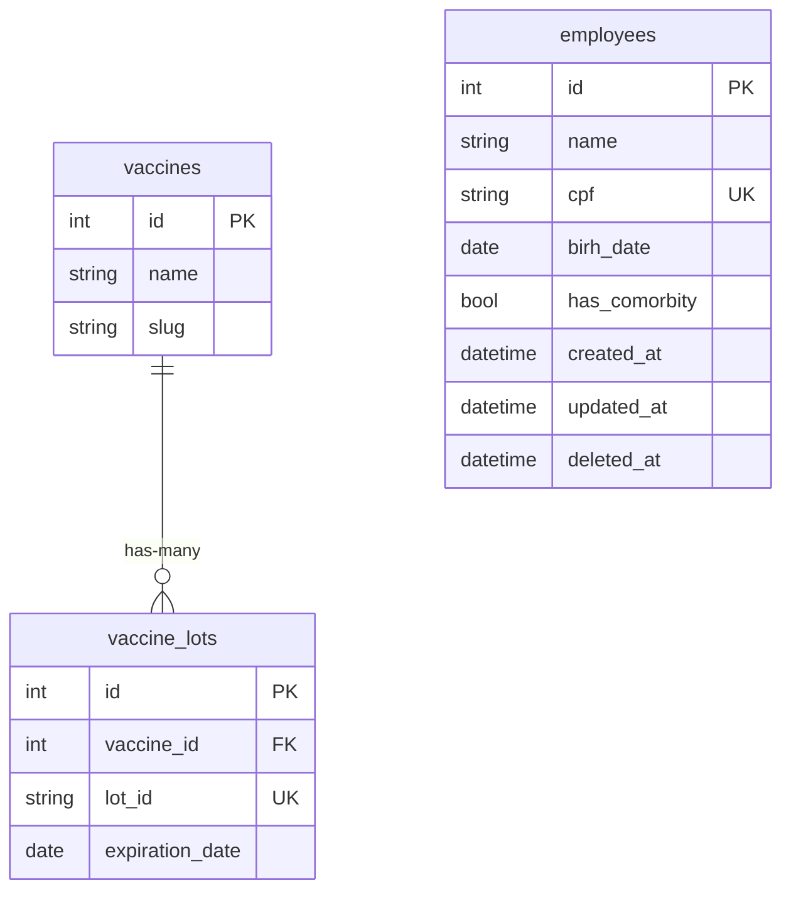

# Challenge Controle de Vacinação

## Database ER

### Vacinas
Cada vacina pode ter vários lotes.
Cada lote de vacina possui apenas uma data de validate.

# Funcionários
Cada CPF de funcionário é único.
